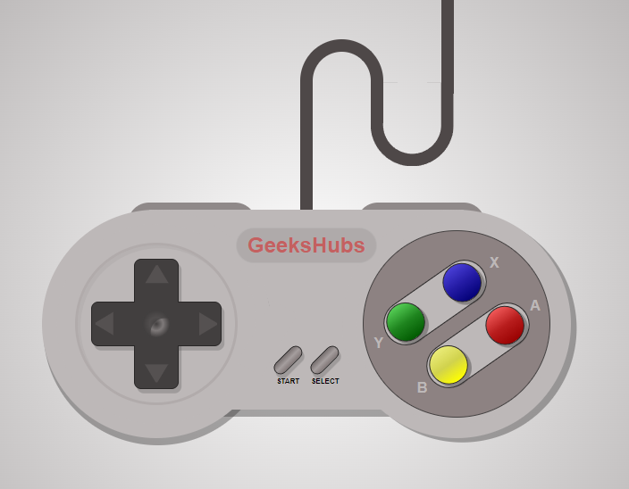

<h1 align="center">
      Super Nintendo Controller
</h1>

<h4 align="center">Replíca del mando de la Super Nintendo. Por José Carlos Núñez.</h4>

 

    <a href="#about">About</a>·
    <a href="#features">Features</a>·

---

##About

**Super Nintendo Controller** es una replíca visual del clásico mando de Nintendo, esta realizado con HTML5 y CSS3.
 

 
 Screenshoot (PC)

La **Super Nintendo Entertainment System**, conocida popularmente como la Super Nintendo,tambien llamada de forma abreviada como la Super NES o SNES en América y como la Super Nintendo en Europa, es la segunda videoconsola de sobremesa de Nintendo y la sucesora de Nintendo Entertainment System (NES) en América y Europa. Mantuvo una gran rivalidad en todo el mundo con la Sega Mega Drive (o Sega Genesis) durante la era de 16 bits. Fue descontinuada en el año 1999 (2003 en Japón) y años más tarde, fue relanzada virtualmente a través de la Consola Virtual en la Wii en 2006, Wii U en 2013, Nintendo 3DS (solo la versión New) en 2016 y Nintendo Switch en 2019 (no a través de la Consola Virtual, si no a través del servicio en línea Nintendo Switch Online).

##Features

*Responsive
*Realizado solo por HTML5 y CSS3